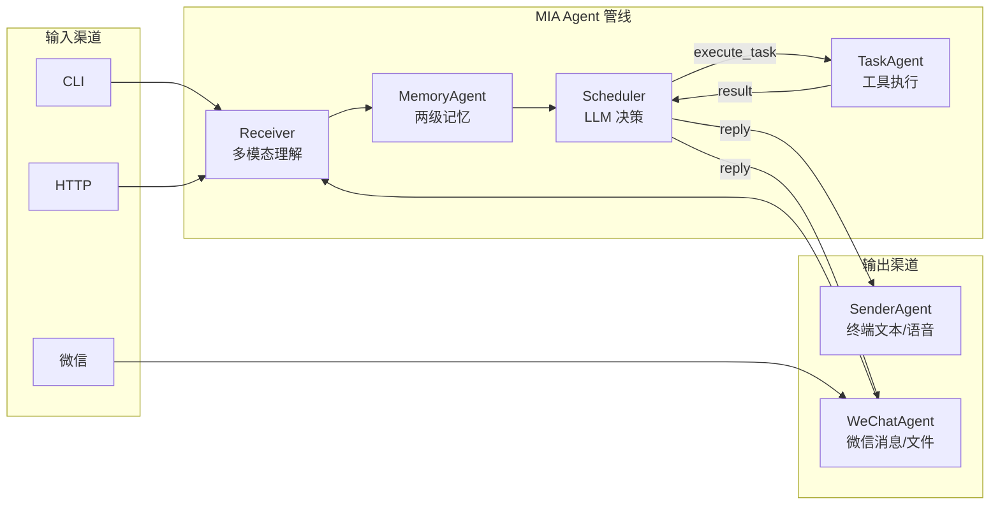

# MIA — Modular Intelligent Agent

基于 **LLM 决策循环** 的多 Agent 对话系统，模拟人类"理解 → 检索 → 规划 → 执行 → 回复"的思考链路。

> **MIA** 不是某个特定模型的产品名，而是 **Agent 架构框架**。当前默认接入 MiMo API，支持任意 OpenAI 兼容 Provider 可插拔替换。

## 架构


> 6 个 Agent，1 条 MessageBus。输入多渠道，输出回原路（渠道感知路由）。

## 特性

- **LLM 决策循环** — Scheduler 不断分析状态 → 派发任务 → 观察结果 → 决定回复，而非一次性生成
- **两级知识记忆** — 临时记忆 (Level 1) + 持久知识 (Level 2)，从对话中自动提炼知识点，支持跨轮关联
- **微信通信渠道** — 接入微信个人号 (iLink Bot API)，支持文字/语音/图片消息，SILK→WAV 解码 + TTS→CDN 语音发送
- **渠道路由** — session_id 编码来源，回复自动原路返回 (微信⇢微信, CLI⇢终端)，互不干扰
- **总线记忆镜像** — MessageBus 自动镜像投递给 MemoryAgent，不依赖显式 CONVERSATION_DONE
- **对话历史注入** — 每轮自动将最近 N 轮对话原文注入 LLM 上下文，解决指代和连续对话问题
- **收发分离** — WeChat 拆为 WeChatReceiver + WeChatSender，context_token 通过 payload 透传
- **可插拔 Provider** — 支持 OpenAI / MiMo / DeepSeek 或任意兼容 API，通过 `.env` 配置切换
- **消息总线架构** — Agent 间通过 MessageBus 松耦合通信，每个 Agent 独立运行在事件循环中
- **多模态输入** — 支持文本、图片 (MiMo VL)、语音 (MiMo-V2.5 多模态理解 — 内容+情绪+意图)
- **语音收发** — 入站 SILK→WAV 转码 (pilk) → MiMo 多模态理解；出站 TTS→CDN 上传→微信 file_item 发送
- **工具调用** — TaskAgent 支持天气查询、DuckDuckGo 搜索、Shell 命令、文件操作
- **TUI 记忆浏览器** — `/memory` 命令提供全量加载、按日期分组、分页浏览 (10条/页) + 详情 rich.Table
- **持久化存储** — 知识条目按日期分片存储，index + daily JSON 文件架构，关闭时自动落盘

## 快速开始

### 环境要求

- Python 3.11+
- Windows / Linux / macOS

### 安装

```bash
git clone https://github.com/linnin233/mia.git
cd mia
pip install -e ".[dev,audio,wechat]"

# 微信渠道依赖: pycryptodome (AES 加解密) + pilk (SILK 解码)
```

### 配置

创建 `.env` 文件 (项目根目录):

```bash
# 主 Provider
MIMO_API_KEY=your_api_key_here

# 可选: 备选 Provider
DEEPSEEK_API_KEY=your_deepseek_key

# 可选: Agent 行为配置
MIA_MEMORY_HISTORY_TURNS=5       # 对话历史保留轮数
MIA_MEMORY_EXTRACTION_TIMEOUT=8.0 # 知识提取超时秒数
```

### 运行

```bash
# 交互模式 (推荐)
python -m mia

# 交互模式 + 微信渠道
python -m mia --wechat

# 单次查询
python -m mia --query "你好，我叫linnin"

# 单次查询 + 图片/语音
python -m mia --query "分析这张图" --image screenshot.png
python -m mia --query "总结" --voice meeting.mp3

# HTTP API 服务器
python -m mia --server --port 8080

# 运行测试
pytest
```

### 交互命令

| 命令 | 说明 |
|------|------|
| 直接输入文本 | 开始一轮对话 |
| `/memory` | 打开 TUI 知识浏览器 (临时记忆 + 持久知识) |
| `/compact` | 压缩对话历史为知识摘要 |
| `/verbose` | 切换详细日志 |
| `/image <path>` | 发送图片 (配合下一行文字说明) |
| `/voice <path>` | 发送音频文件 (多模态理解) |
| `/record` | 从麦克风录音并发送 |
| `/help` | 显示帮助 |
| `/quit` | 退出 |

## 项目结构

```
mia/
├── src/mia/
│   ├── agents/           # Agent 实现
│   │   ├── receiver.py   # 多模态理解
│   │   ├── memory.py     # 两级记忆 + 对话历史
│   │   ├── scheduler.py  # LLM 决策循环 + 渠道感知路由
│   │   ├── task.py       # 工具调用
│   │   └── sender.py     # 终端输出 (文本/流式/语音)
│   ├── channels/         # 通信渠道 (可选, 收发分离)
│   │   └── wechat/
│   │       ├── receiver.py # WeChatReceiverAgent (入站长轮询+SILK解码)
│   │       ├── sender.py   # WeChatSenderAgent (出站TTS+CDN发送)
│   │       ├── client.py   # ILinkClient (iLink HTTP API)
│   │       └── utils.py    # AES-128-ECB 加解密 + 请求头
│   ├── audio/            # 音频子系统
│   │   ├── recorder.py   # 麦克风录音
│   │   └── playback.py   # 本地音频播放
│   ├── memory/           # 记忆子系统
│   │   ├── store.py      # 知识存储 (index + daily JSON)
│   │   ├── retriever.py  # 关键词 + LLM 混合检索
│   │   └── browser.py    # TUI 记忆浏览器
│   ├── bus/              # 消息总线
│   ├── providers/        # LLM Provider (OpenAI/MiMo/DeepSeek)
│   ├── tools/            # 工具实现 (天气/搜索/Shell/文件)
│   ├── config.py         # 配置管理 (pydantic-settings)
│   └── main.py           # 入口: CLI 交互 + HTTP 服务
├── tests/                # 测试 (11 个)
├── workspace/            # TaskAgent 工作目录
└── pyproject.toml
```

## 测试

```bash
# 单元测试 (11 个)
pytest

# 全流程测试 (需 MIMO_API_KEY)
python tests/test_full_pipeline.py
```

### 微信端手动测试清单

| # | 测试项 | 操作 | 预期 |
|---|--------|------|------|
| 1 | 文本收发 | 微信发送"你好" | 收到文字回复 |
| 2 | 语音 → 文字回复 | 微信发语音"介绍一下你自己" | 收到文字回复，包含 MIA 介绍 |
| 3 | 语音 → 语音回复 | 微信发语音"语音回复我" | 收到可播放的音频文件 + 🎤文字 |
| 4 | 语音情绪理解 | 微信发语音(带情绪) | 回复中体现对情绪的理解 |
| 5 | 天气查询 | 微信发"查询嘉兴明天天气" | 返回天气结果(含温度/风力/降雨) |
| 6 | 跨轮记忆 | 先问天气 → 再问"刚才查过什么" | 第二论回复提及第一轮内容 |
| 7 | 图片发送 | 微信发一张图片 | MIA 描述图片内容 |
| 8 | 记忆持久 | 退出重启 → 问"记得我吗" | 回复包含用户名 linnin233 |

## License

MIT
